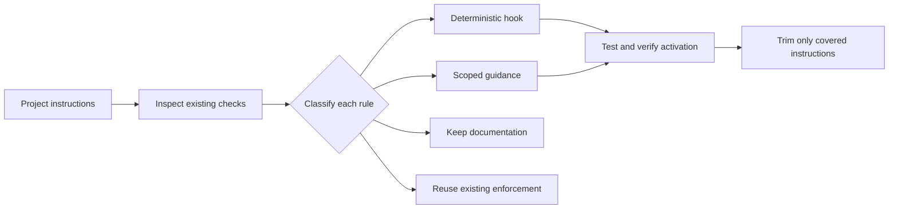

# docs-to-hooks

**Keep the safeguard. Reclaim the context.**

An agent skill that turns repeatable instructions in `CLAUDE.md`, `AGENTS.md`,
and project rules into tested hooks for **Claude Code and Codex**.

That “always check this” paragraph exists for a reason. Keep the protection.
Move the check to the moment it matters, instead of asking the agent to keep
remembering it throughout every task.

```text
Before:  “After every task, validate the catalog structure…”
After:   A Stop hook runs the validator and reports a failure.
Docs:    Keep the rationale, exceptions, and implementation pointer.
```

[Install](#install) · [Try the example](#try-the-example) ·
[How it works](#how-it-works) · [Compatibility](#compatibility)

## Why this exists

Good documentation made project knowledge available. Agent instructions now
often carry another job: remembering safeguards, running checks, and repeating
procedures. A growing instruction file can turn into an operating manual the
agent must carry into unrelated work.

Some of those instructions are executable requirements. A hook can check them
at a specific event. Other instructions only matter for certain files; they can
arrive when the agent touches those files. Architecture, tradeoffs, and exceptions
still belong in documentation.

The benefit is **less standing context and observable checks**. The tradeoff is
code to maintain, execution time, and occasional feedback in context. Fewer lines
alone do not prove lower token bills or better agent results. Hooks can also be
disabled, miss tool paths, or fail: coverage must be demonstrated.

| Instruction | Better home | What it actually does |
| --- | --- | --- |
| “Do not edit build output.” | File-edit guard + retained rule | Blocks supported edit tools; the rule still covers shell writes. |
| “For UI work, consult the interaction guide.” | Scoped context hook + guide | Delivers the reference when relevant; does not enforce accessibility. |
| “Validate this data file before finishing.” | Bounded Stop check | Runs a validator and requests one repair; reports unresolved failure. |
| “Keep previews usable offline.” | Documentation | Preserves architectural intent that needs judgment. |
| “Use the existing code style.” | Existing formatter/linter | Reuses the project's enforcement instead of creating another policy. |

## Install

You need Claude Code or Codex. The bundled examples and JSON merge helper need
**Node.js 22+**, Git, and macOS or Linux. The skill can adapt generated hooks to
the target project's existing runtime.

Clone once:

```sh
mkdir -p "$HOME/.local/share"
git clone https://github.com/dami4nv/docs-to-hooks.git "$HOME/.local/share/docs-to-hooks"
```

Then run **one** of these blocks from the project you want to improve.
The existence check prevents accidentally copying over an installed skill.

**Claude Code**

```sh
mkdir -p .claude/skills
test ! -e .claude/skills/docs-to-hooks && \
  cp -R "$HOME/.local/share/docs-to-hooks/skills/docs-to-hooks" .claude/skills/docs-to-hooks
```

```text
/docs-to-hooks Audit this project's agent instructions. Do not change files.
/docs-to-hooks Convert repeatable instructions into tested hooks. Trim only verified rules.
```

**Codex**

```sh
mkdir -p .agents/skills
test ! -e .agents/skills/docs-to-hooks && \
  cp -R "$HOME/.local/share/docs-to-hooks/skills/docs-to-hooks" .agents/skills/docs-to-hooks
```

```text
$docs-to-hooks Audit this project's agent instructions. Do not change files.
$docs-to-hooks Convert repeatable instructions into tested hooks. Trim only verified rules.
```

For a personal installation, use `~/.claude/skills/` or `~/.agents/skills/`
instead. Pick one scope per agent to avoid competing copies. Start a fresh agent
session if the new skill is not discovered.

**Installing the skill installs no active hooks.** A conversion creates hooks in
the selected project. Codex requires native trust for new or changed hooks;
the skill retains affected instructions until activation is verified.

To update, pull this checkout, compare its skill directory with your installed
copy, back up any customizations, and replace that copy with the complete updated
directory. Do not copy a new skill directory *inside* the existing one. Updating
the skill does not update previously generated project hooks; rerun an audit.

## How it works



The [skill](skills/docs-to-hooks/SKILL.md) reads the relevant project instructions
and existing automation, then records a decision for each candidate rule. It
creates project-local scripts and merges hook definitions without replacing
unrelated settings. An explicit audit is read-only; a conversion proceeds through
implementation and tests.

A conversion leaves you with:

- Hook scripts and platform configuration, adapted to your project.
- Tests covering matching, nonmatching, and failure cases.
- A compact conversion record linking each source rule to its implementation,
  coverage, verification, and remaining gaps.
- Shorter standing instructions **where the replacement is tested and active**.

Partial coverage, failed tests, unsupported versions, or pending native trust
mean the affected instructions stay. The skill does not add a model call to every
hook invocation or require a new service or API key. Running the skill itself
uses your existing coding agent as usual.

## Try the example

From this checkout, with Node.js 22+ on your PATH:

```sh
npm test
npm run check
npm run demo
```

No `npm install` is needed. The demo copies a fictional catalog project into a
temporary directory, executes the three hook scripts with fixture inputs, and
cleans up. It does **not** install hooks, launch an agent, or rewrite your docs.

The example compares [31 lines of standing instructions](examples/catalog-project/AGENTS.md)
with a [16-line after-state](examples/after/AGENTS.md), including headings and
blank lines. The script computes these counts from the files. The after-state is
illustrative and requires verified activation; the broad generated-file rule
stays because the edit guard cannot cover shell writes.

See the [walkthrough](docs/walkthrough.md) for payloads, configuration merging,
and rollback, and [verification](docs/verification.md) for native runtime evidence
and its limits. The reusable examples live inside the skill so clone-and-copy
installation includes everything it references.

## Compatibility

| Agent | Skill installation | Generated hook configuration | Status |
| --- | --- | --- | --- |
| Claude Code | `.claude/skills/docs-to-hooks/` | `.claude/settings.json` | Script-tested; native verification pending login |
| Codex | `.agents/skills/docs-to-hooks/` | Existing `.codex` hook representation; JSON default | Native smoke verified on 0.154.0 |
| Cursor | — | — | Future target |
| OpenCode | — | — | Future target |

See the [dated verification record](docs/verification.md) for evidence and limits.
The platform references are deliberately separate: similar event names do not
guarantee identical payloads, tool coverage, or activation behavior. Official
references: [Claude hooks](https://code.claude.com/docs/en/hooks),
[Codex hooks](https://learn.chatgpt.com/docs/hooks),
[Claude skills](https://code.claude.com/docs/en/skills), and
[Codex skills](https://learn.chatgpt.com/docs/build-skills).

This is a skill with tested examples, not a general documentation compiler.
Hooks complement permissions, sandboxing, tests, and CI. The example file guard
covers native edit tools, the context hook supplies a reminder, and the Stop
hook bounds retries rather than guaranteeing successful completion. See
[coverage details](docs/walkthrough.md#coverage-and-failure-behavior).

## Contributing

A good contribution demonstrates a real instruction, an appropriate event, and
observable behavior—including where the hook cannot help. Start with
[CONTRIBUTING.md](CONTRIBUTING.md). Additional runtime adapters should include
native verification, not just renamed configuration keys.

Created by [Damian Vuceljic](https://github.com/dami4nv). [MIT licensed](LICENSE).
